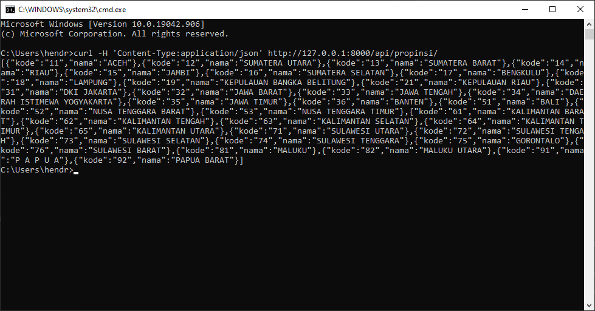
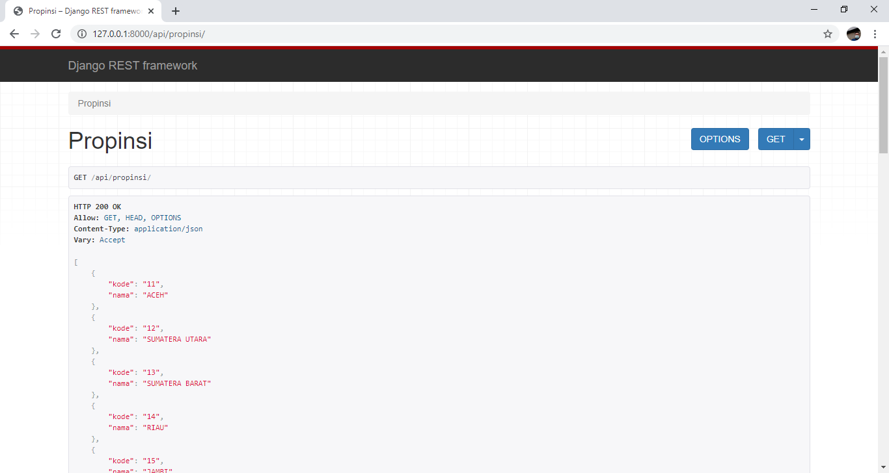

# Domisili Wilayah Indonesia

## Deskripsi Proyek

Data wilayah di Indonesia, mulai dari Propinsi, Kabupaten/Kotamadya, Kecematan dan Kelurahan/Desa. Data ini digunakan
sebagai basis data dari alamat untuk aplikasi yang membutuhkan data alamat yang berhubungan dengan seluruh wilayah di
Indonesia.

## Permulaan

### Dependensi

* Python 3.8
* Django 3.2
* Django Rest Framework 3.12.4

### Instalasi

Instalasi semua paket depensi yang dibutuhkan oleh aplikasi dengan perintah.

```
pip install -r requirements.txt
```

### Memuat data daerah ke database

Muat seluruh data daerah di Indonesia yang ada pada **db.json** ke dalam basisdata.

```
python manage.py migrate
python manage.py loaddata db.json
```

### Eksekusi program

Testing semua fungsi yang ada di aplikasi ini.

```
python manage.py test
```

Menjalankan server api dari aplikasi ini.

```
python manage.py runserver
```

## Ujicoba

### API Propinsi

Ujicoba menggunakana utilitas *curl* dari command prompt (terminal).

```
curl -H 'Content-Type:application/json' http://127.0.0.1:8000/api/propinsi/
```

Contoh tampilan ketika dijalankan di command prompt



Contoh tampilan lain jika diakses dari browser (chrome)



## Kontributor

[@hendrapaiton](https://github.com/hendrapaiton/)

## Lisensi

Proyek ini menggunakan lisensi [MIT](LICENSES).

## Penghargaan

Inspirasi, Potongan Kode, dan lain-lain.

* [cahyadsn-wilayah](https://github.com/cahyadsn/wilayah)
* [Badan Pusat Statistik](https://sig-dev.bps.go.id/webgis/pencariankodenama)
